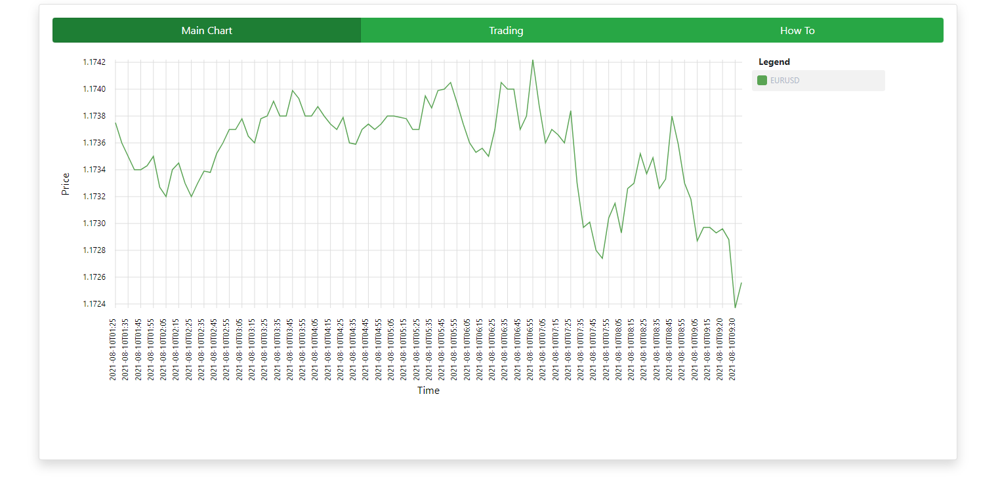

# TradingApp
This app is simulating forex trading on EUR/USD currency pair.
Deployed on heroku (wait a moment for heroku to wake up):  https://protected-stream-68029.herokuapp.com/trading

## General Info
This app is my earlier project (https://github.com/Luke1024/financial-analytics) extremely simplified to actually make it possible to finish it in a reasonable time (or finish at all) and show it as a portfolio project. The idea for this app came to me naturally because I was engaged in trading earlier in my career.
This app can simulate trading on the forex market on EUR/USD currency pair. App using external API to update EUR/USD exchange rate in real-time every 5 minutes (limits of free API) and using this data to compute profits and balance of accounts created by a user.

## Screenshots

## Status:
*this app is work in progress

## Built with
* Angular
* Spring Boot
* Gradle

## Contact
chajdas.lukasz@gmail.com